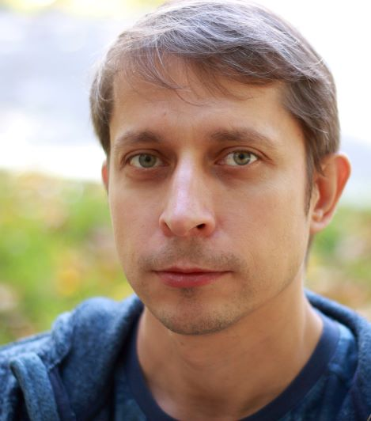

## Добрый день!
>Меня зовут Алексей Поляшов.
>На данной странице представлена краткая информация обо мне и моем опыте в java разработке.

## Мои Навыки:
1. 

## Учебные проекты:

1. [Онлайн магазин][1]
2. [Облачное хранилище файлов][2]
3. [Простой чат][3]

[1]: https://github.com/alexey-polyashov/javaCode/projects/3 "Онлайн магазин" 
[2]: https://github.com/alexey-polyashov/javaCode/projects/2 "Облачное хранилище файлов"
[3]: https://github.com/alexey-polyashov/javaCode/projects/1 "Прочтой чат"

## Где я получил опыт программирования на Java:
1. Курс на geeckbrains
2. Книги: 

## Образование:
Окончил Военный Инженерно Космический Университет им. АФ Можайского в 2002 году, по специальности Радиоэлектронные системы.

